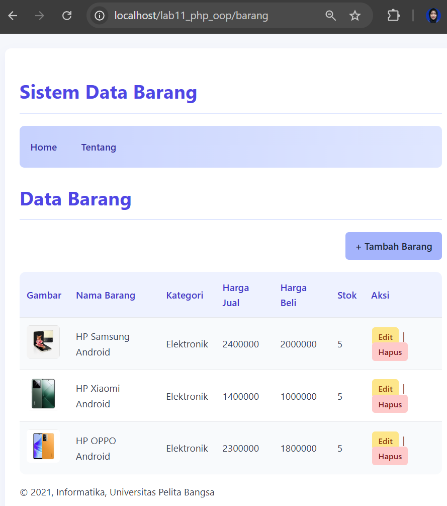
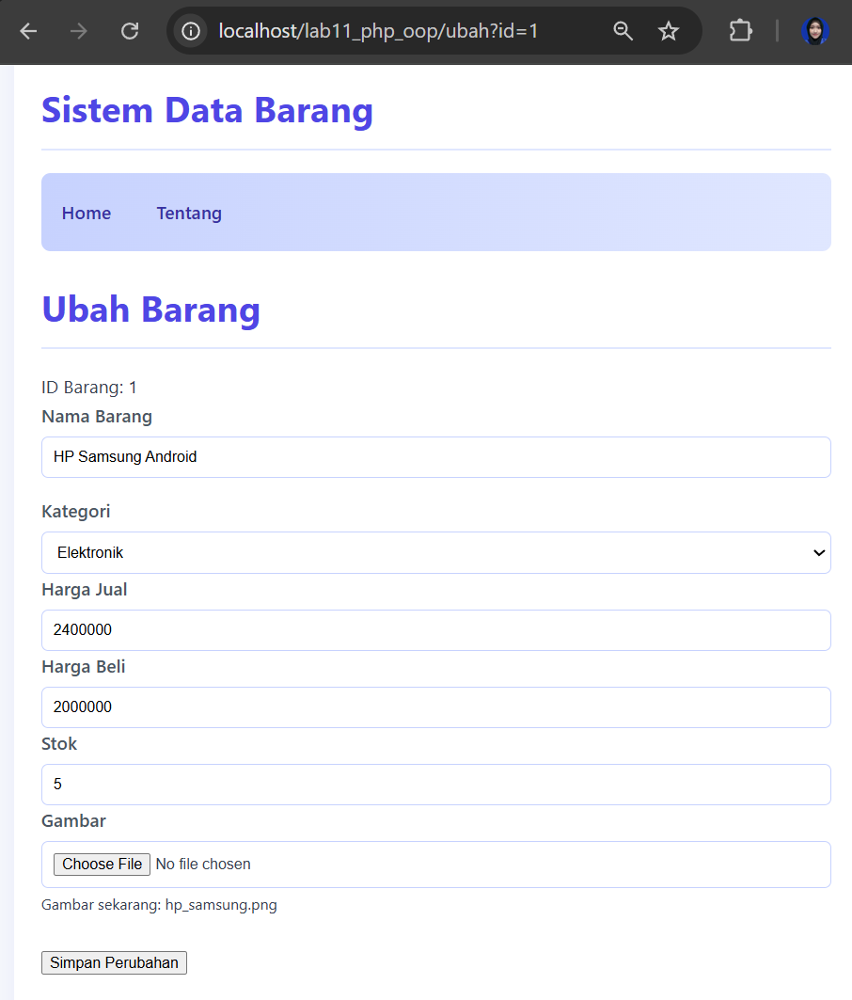
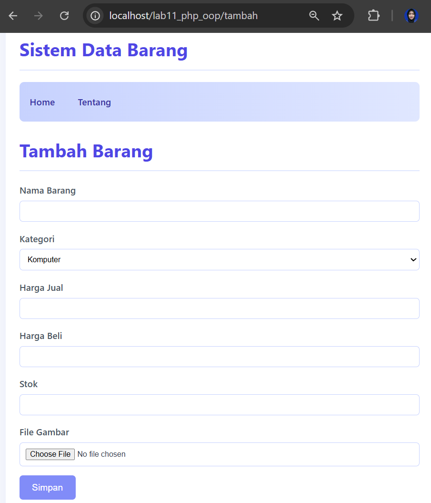

# Praktikum 11
| Nama                     | Kelas    | NIM       | Mata Kuliah           | Tugas |
|---------------------------|----------|------------|------------------------|--------|
| Friska Pebriana Lestari   | TI.24.A1 | 312410160  | Pemrograman Web 1      | pertemuan 13    |

# Struktur Folder
```
lab11/
│
├─ index.php        # Router utama
├─ .htaccess        # Routing URL
├─ barang.php       # Halaman daftar barang
├─ tambah.php       # Tambah data
├─ ubah.php         # Edit data
├─ hapus.php        # Hapus data (POST)
├─ BarangModul.php  # Class Barang (OOP)
├─ koneksi.php      # Koneksi database
├─ header.php
├─ footer.php
└─ gambar/           # Upload gambar
```

## PHP OOP CRUD dengan Routing (.htaccess)

Project ini merupakan aplikasi CRUD Data Barang berbasis PHP Native yang menerapkan:

- Konsep OOP (Object-Oriented Programming)

- Modularisasi file

- Routing sederhana menggunakan .htaccess

- MySQL sebagai database

Project ini dibuat untuk memenuhi tugas Lab Pemrograman Web / PHP OOP.

## Fitur

- Menampilkan data barang

- Tambah data barang (dengan upload gambar)

- Ubah data barang

- Hapus data barang (menggunakan metode POST + konfirmasi)

- Routing URL tanpa .php

- Struktur kode modular & OOP

## Gambar



